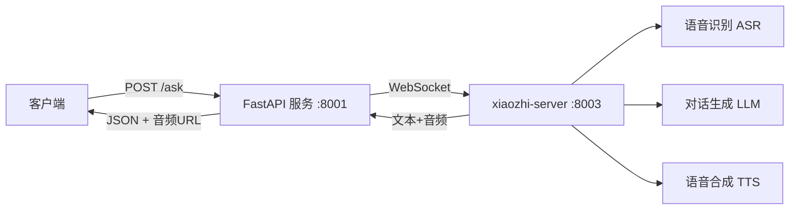

# 🎙️ Voice Q&A Service

基于 FastAPI 的智能语音问答服务，封装 xiaozhi-server 的 WebSocket 能力，对外提供简洁的 REST API。支持语音输入（自动 ASR + LLM + TTS）和纯文本输入（跳过 ASR 直接对话），返回文本回复及合成语音文件 URL。

## 📐 系统架构



## 🚀 快速部署

### 环境要求

- Python 3.9+
- 电脑已安装FFmpeg并添加到Path（用于 TTS 语音合成）

### 安装步骤

1. **克隆仓库**（或直接复制文件）
   ```bash
   git clone https://github.com/your-repo/voice-service.git
   cd voice-service
   ```

2. **安装依赖**
   ```bash
   pip install -r requirements.txt
   ```

3. **启动服务**
   - 启动 xiaozhi-server（需单独启动，源代码及其介绍见 [xiaozhi-server](https://github.com/your-repo/xiaozhi-server)，可打开xiaozhi-server文件夹下的README.md查看启动方法）
   
   - 启动 FastAPI 服务
   ```bash
   uvicorn main:app --host 0.0.0.0 --port 8001 --reload
   ```

4. **验证服务**
   - 健康检查：`curl http://localhost:8001/health`
   - 交互文档：`http://localhost:8001/docs`

## 📄 API 接口

### `POST /ask`

支持 `multipart/form-data` 格式，接受音频文件或纯文本（至少提供一个）。

#### 请求参数

| 参数名       | 类型          | 必填 | 说明                                           |
| ------------ | ------------- | ---- | ---------------------------------------------- |
| `audio_file` | `file`        | 否*  | 上传的音频文件（支持 wav, mp3, ogg 等常见格式） |
| `text`       | `string`      | 否*  | 直接输入的文本问题                             |

> * 至少提供一个参数，同时提供时优先使用 `audio_file`。

#### 响应格式 (JSON)

```json
{
  "recognized_text": "用户语音识别的文本 或 用户直接输入的文本",
  "reply_text": "AI 生成的回复内容",
  "reply_audio_url": "/audio/reply_xxx.wav"   // 若生成了语音则返回可访问URL，否则为 null
}
```

#### 错误响应

```json
{
  "detail": "Provide audio_file or text"
}
```

## 🧪 测试示例

### 使用 cURL

#### 文本输入
```bash
curl.exe -X POST http://localhost:8001/ask -F "text=今天的农历日期是？"
```
```bash
curl.exe -X POST http://localhost:8001/ask -F "text=请你介绍一下你自己吧"
```
```bash
curl.exe -X POST http://localhost:8001/ask -F "text=你喜欢看什么电视剧？"
```
```bash
curl.exe -X POST http://localhost:8001/ask -F "text=你有什么特长？"
```

#### 语音输入
```bash
curl.exe -X POST http://localhost:8001/ask -F "audio_file=@test1.wav"
```
```bash
curl.exe -X POST http://localhost:8001/ask -F "audio_file=@test2.wav"
```
```bash
curl.exe -X POST http://localhost:8001/ask -F "audio_file=@test3.wav"
```
```bash
curl.exe -X POST http://localhost:8001/ask -F "audio_file=@test4.wav"
```

### 使用 Postman

### Postman 导入示例

1. 创建新请求，方法 `POST`，URL `http://localhost:8001/ask`
2. Body 选择 `form-data`
3. 添加字段：
   - `audio_file`（类型 File）或 `text`（类型 Text）
4. 发送即可

> 可导出为 Postman Collection 文件（见仓库 `/postman` 目录）

## 📁 项目结构

```
voice-service/
├── xiaozhi-server/         # xiaozhi-server 项目，需单独启动
├── main.py                 # FastAPI 入口，定义 /ask 接口
├── xiaozhi_service.py      # WebSocket 客户端（封装与 xiaozhi-server 通信）
├── audio_utils.py          # 音频格式转换、Opus 编解码工具
├── requirements.txt        # 依赖列表
├── README.md               # 本文档
├── temp_audio/             # 临时音频文件存储目录（自动创建）
└── postman_collection.json # Postman 测试集合（可选）
```

## ⚙️ 配置说明

服务默认监听 `8001` 端口，可通过 `uvicorn` 参数调整，例如：

```bash
uvicorn main:app --port 8080
```

## 🧹 清理临时文件

服务自动将生成的音频文件保存在 `temp_audio/` 目录，建议定期手动清理或添加定时任务：

```bash
rm -rf temp_audio/*.wav
```

## 🐛 常见问题

### 1. 端口 8001 被占用
```bash
# Windows
netstat -ano | findstr :8001
taskkill /PID <PID> /F

# Linux/Mac
lsof -i :8001
kill -9 <PID>
```
或改用其他端口启动。

### 2. 连接 xiaozhi-server 失败
- 确认 xiaozhi-server 已启动：访问 `http://127.0.0.1:8003/xiaozhi/ota/` 应返回 JSON（即便报错，说明服务在运行）
- 检查防火墙和网络配置

### 3. 音频格式不支持
- 确保已安装 `librosa` 和 `soundfile`（`requirements.txt` 已包含）
- 若仍需支持更多格式，可安装 `ffmpeg` 并改用 `pydub`

### 4. 文本输入无响应
- 当前文本输入通过 `listen` + `text` 字段实现，依赖 xiaozhi-server 原生支持。若您的服务器版本不支持，可修改 `xiaozhi_service.py` 中的 `ask_text` 方法，改为调用外部 LLM（如 OpenAI）或发送静音音频作为 fallback。

## 📝 TODO

- [ ] 增加 WebSocket 自动重连机制
- [ ] 支持流式返回 TTS 音频分块
- [ ] 添加请求队列和并发限制
- [ ] 集成 OpenAI 作为备选 LLM

## 📄 License

本项目采用 MIT 许可证。